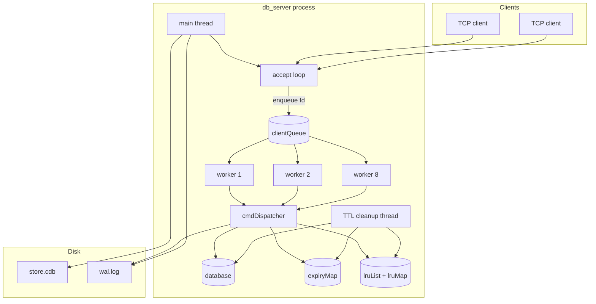
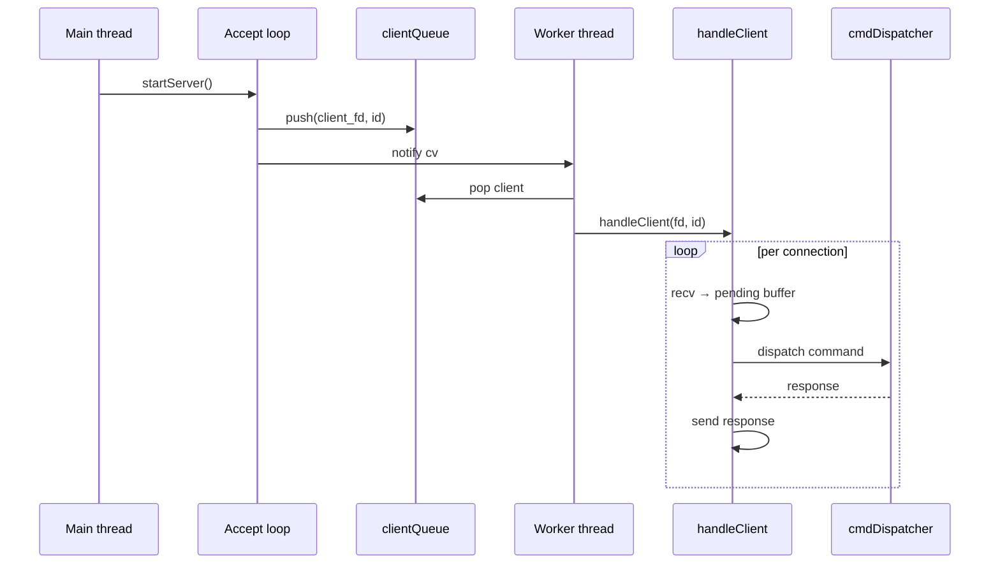
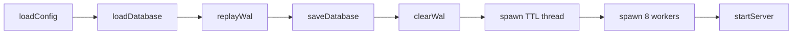
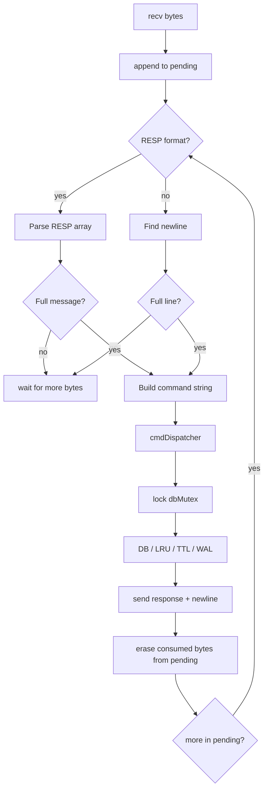
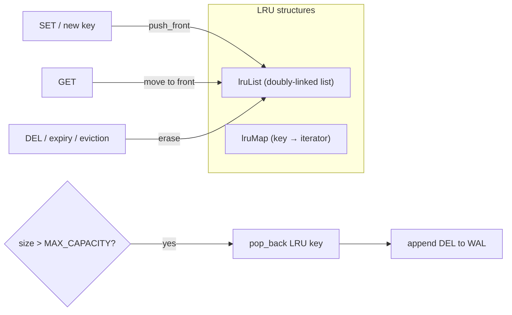
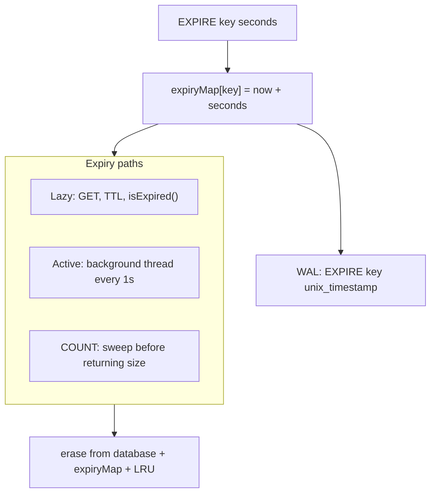
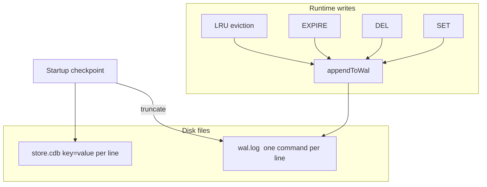
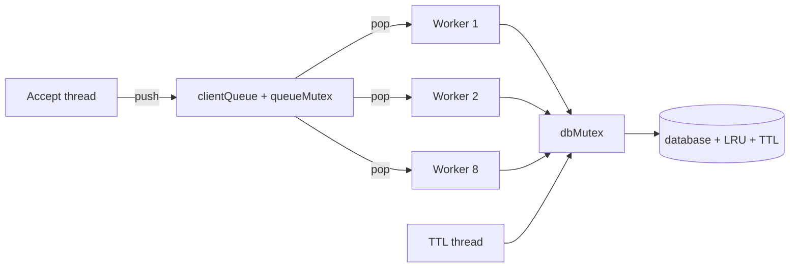

# Mini Redis

> A from-scratch, **Redis-inspired** in-memory key-value database built in **C++17** — designed to teach real database concepts: TCP networking, concurrency, persistence, TTL, LRU eviction, and protocol parsing.

This is **not** the official Redis project. It is a compact, readable server (~900 lines) that implements the core *ideas* behind production in-memory stores.

**Repository:** [github.com/gaurav-singh2525/redis](https://github.com/gaurav-singh2525/redis)

---

## Highlights

| | |
|---|---|
| **In-memory KV store** | `unordered_map` with string keys and values |
| **Multi-client TCP** | Port configurable via `configs/server.conf` (default **9000**) |
| **Worker thread pool** | 8 workers + bounded accept queue — not one OS thread per client forever |
| **Dual protocol** | Plain text lines **or** RESP array input (`*argc` + bulk strings) |
| **LRU eviction** | O(1) touch/evict with `list` + iterator map; configurable capacity |
| **TTL** | `EXPIRE` / `TTL` with lazy + active expiry |
| **Durability** | Snapshot (`store.cdb`) + write-ahead log (`wal.log`) |
| **Crash recovery** | Load → replay → checkpoint on every startup |
| **Full reset** | `CLEAR` wipes memory **and** disk |

---

## Table of contents

1. [Architecture](#architecture)
2. [Startup & recovery flow](#startup--recovery-flow)
3. [Runtime request flow](#runtime-request-flow)
4. [Key subsystems](#key-subsystems)
5. [Project structure](#project-structure)
6. [Build & run](#build--run)
7. [Configuration](#configuration)
8. [Protocol](#protocol)
9. [Commands](#commands)
10. [Examples](#examples)
11. [Limitations](#limitations)

---

## Architecture



### Threading model



| Component | File | Role |
|-----------|------|------|
| Entry & boot | `src/main.cpp` | Config, recovery, spawn TTL + workers, start server |
| Config | `src/config.cpp` | Load `configs/server.conf` |
| Accept loop | `src/server.cpp` | `bind` / `listen` / `accept`, enqueue clients |
| Worker pool | `src/worker.cpp` | 8 threads dequeue and run `handleClient` |
| Client I/O | `src/client_handler.cpp` | `pending` buffer, text + RESP framing |
| Commands | `src/db.cpp` | `cmdDispatcher` — all command logic |
| Parser | `src/parser.cpp` | Plain-text tokenization |
| LRU | `src/lru.cpp` | Touch, insert, evict, `formatLruList` |
| Persistence | `src/persistence.cpp` | Snapshot load/save, WAL replay |
| WAL | `src/wal.cpp` | Append-only log |
| TTL sweeper | `src/ttl_cleanup.cpp` | Background expiry every 1s |
| Logging | `src/logger.cpp` | Timestamped stdout logs |
| Global state | `src/global.cpp` | DB, mutexes, queues, paths |

---

## Startup & recovery flow

Every time the server starts, it rebuilds consistent state from disk before listening:



| Step | What happens |
|------|----------------|
| **loadConfig** | Read `configs/server.conf` (port, paths, capacity) |
| **loadDatabase** | Restore `key=value` pairs from snapshot into memory + LRU |
| **replayWal** | Apply `SET`, `DEL`, `EXPIRE` entries written since last snapshot |
| **saveDatabase** | Checkpoint merged state back to snapshot |
| **clearWal** | Truncate WAL — clean slate after successful recovery |
| **TTL thread** | Detached; sweeps `expiryMap` every second |
| **Workers** | 8 detached threads wait on `clientQueue` |
| **startServer** | Blocks in accept loop |

> **Important:** TTL metadata lives in `expiryMap` and WAL, **not** in the snapshot file. After a clean restart, TTL state is only restored from WAL entries replayed before checkpoint.

---

## Runtime request flow


### `pending` buffer (TCP-safe reads)

TCP is a **byte stream** — one `recv()` does not equal one command. `handleClient` accumulates all bytes in `pending` and only dispatches when a **complete** message is available:

- **Text mode:** waits for `\n`
- **RESP mode:** waits for `*argc`, each `$len` line, and exactly `len` bytes + `\r\n` per argument

Incomplete packets stay in `pending` — they are **not** treated as invalid.

---

## Key subsystems

### 1. In-memory database

```cpp
unordered_map<string, string> database;   // key → value
mutex dbMutex;                            // protects all shared state
```

All reads and writes go through `cmdDispatcher` under `dbMutex`.

---

### 2. LRU cache eviction



| Operation | LRU effect |
|-----------|------------|
| `SET` (new key) | Insert at front; may trigger eviction |
| `SET` (existing) | Touch → move to front |
| `GET` | Touch → move to front |
| `DEL` / expiry / eviction | Remove from list |
| `LRU` | Print order MRU → LRU |
| `CAPACITY` | Return max key count |

**Eviction policy:** When `database.size() > MAX_CAPACITY`, remove the **back** of `lruList` (least recently used). Evicted keys get a `DEL` entry in the WAL.

**Data structures:** `std::list<std::string>` + `std::unordered_map<std::string, list::iterator>` for O(1) touch and evict.

---

### 3. TTL (time-to-live)



| Detail | Behavior |
|--------|----------|
| `EXPIRE` at runtime | Relative seconds → stored as absolute `time_point` |
| WAL `EXPIRE` entry | Absolute Unix timestamp (replay-safe) |
| `SET` on a key | Clears existing TTL |
| `TTL` responses | Seconds left, `NO TTL`, or `TTL EXPIRED OR KEY DNE` |

---

### 4. Persistence (snapshot + WAL)



| File | Format | Contents |
|------|--------|----------|
| `data/store.cdb` | `key=value\n` | Snapshot of all key-value pairs |
| `data/wal.log` | One command per line | `SET`, `DEL`, `EXPIRE` (absolute time) |

**`CLEAR`** truncates both files and wipes all in-memory structures.

---

### 5. Concurrency



- **8 worker threads** handle client connections sequentially per client (one `handleClient` per fd).
- **`dbMutex`** serializes all database, LRU, and TTL map access.
- **`queueMutex` + `condition_variable`** coordinate the accept → worker handoff.
- **Logging** uses a separate `coutMutex` to avoid garbled output.

---

## Project structure

```
redis/
├── configs/
│   └── server.conf       # port, cache_capacity, wal_path, db_path
├── include/              # Headers
│   ├── client_handler.h
│   ├── config.h
│   ├── db.h
│   ├── global.h
│   ├── logger.h
│   ├── lru.h
│   ├── parser.h
│   ├── persistence.h
│   ├── server.h
│   ├── ttl_cleanup.h
│   ├── wal.h
│   └── worker.h
├── src/                  # Implementation
│   ├── client_handler.cpp
│   ├── config.cpp
│   ├── db.cpp
│   ├── global.cpp
│   ├── logger.cpp
│   ├── lru.cpp
│   ├── main.cpp
│   ├── parser.cpp
│   ├── persistence.cpp
│   ├── server.cpp
│   ├── ttl_cleanup.cpp
│   ├── wal.cpp
│   └── worker.cpp
├── data/                 # Runtime (gitignored)
│   ├── store.cdb
│   └── wal.log
├── Makefile
└── README.md
```

---

## Build & run

### Requirements

- **g++** with C++17
- **Linux / POSIX** (Berkeley sockets, pthread)

### Commands

```bash
mkdir -p data
make              # build ./db_server
./db_server       # start server
make run          # build + run
make clean        # remove binary
```

### Connect

```bash
nc localhost 9000
```

Send one command per line. Responses are plain text followed by `\n`.

---

## Configuration

Edit [`configs/server.conf`](configs/server.conf):

```ini
port=9000
cache_capacity=100
wal_path=data/wal.log
db_path=data/store.cdb
```

| Key | Default | Effect |
|-----|---------|--------|
| `port` | `9000` | TCP listen port |
| `cache_capacity` | `100` | Target LRU max keys (see note below) |
| `wal_path` | `data/wal.log` | Write-ahead log path |
| `db_path` | `data/store.cdb` | Snapshot file path |

Loaded at startup via `loadConfig()` in `src/config.cpp`. Missing file → defaults + log message.

> **Note on `cache_capacity`:** `MAX_CAPACITY` (used by LRU eviction and the `CAPACITY` command) is initialized from `CACHE_CAPACITY` at program start. Changing `cache_capacity` in the config updates `CACHE_CAPACITY` but may not change `MAX_CAPACITY` until `MAX_CAPACITY` is wired to reload after config load. Verify with the `CAPACITY` command after changing config.

---

## Protocol

### Plain text

```
SET mykey hello world
GET mykey
PING
```

- Command names are case-insensitive.
- `SET` values can contain spaces (everything after the key is the value).

### RESP (input only)

Supports Redis-style **array of bulk strings** for incoming commands:

```
*3
$3
SET
$4
name
$3
bob
```

**Responses are plain text**, not RESP-encoded.

#### Shell quoting (critical)

In bash, `$3`, `$4`, etc. inside **double quotes** are treated as shell variables. Always use **single quotes** for RESP test commands:

```bash
# correct
printf '*1\r\n$4\r\nPING\r\n' | nc -w 2 localhost 9000

# wrong — $4 is eaten by bash
printf "*1\r\n$4\r\nPING\r\n" | nc localhost 9000
```

#### Split-packet test (partial TCP)

```bash
(
  printf '*3\r\n$3\r\nSE'
  sleep 2
  printf 'T\r\n$4\r\nname\r\n$3\r\nbob\r\n'
) | nc -w 8 localhost 9000
# → OK
```

---

## Commands

| Command | Syntax | Response(s) | WAL | Side effects |
|---------|--------|-------------|-----|--------------|
| `PING` | `PING` | `PONG` | — | — |
| `SET` | `SET key value` | `OK` / `INVALID COMMAND` | `SET key value` | LRU insert/touch; clears TTL; may evict |
| `GET` | `GET key` | value / `NULL` | — | LRU touch; lazy expiry |
| `DEL` | `DEL key` | `OK` / `DNE` | `DEL key` | Removes LRU + TTL |
| `EXPIRE` | `EXPIRE key seconds` | `OK` / `KEY DNE` | `EXPIRE key timestamp` | Sets TTL |
| `TTL` | `TTL key` | seconds / `NO TTL` / `TTL EXPIRED OR KEY DNE` | — | Lazy expiry |
| `COUNT` | `COUNT` | integer | — | Sweeps expired keys first |
| `LRU` | `LRU` | keys MRU→LRU (one per line) or `EMPTY` | — | Read-only |
| `CAPACITY` | `CAPACITY` | max key count | — | Read-only |
| `CLEAR` | `CLEAR` | `OK` | Truncates WAL | Full memory + disk reset |

---

## Examples

### Basic usage

```
PING
→ PONG

SET user:1 Alice
→ OK

GET user:1
→ Alice

DEL user:1
→ OK

COUNT
→ 0
```

### LRU eviction

```
CAPACITY
→ 100

SET k1 v1
SET k2 v2
…
# after exceeding capacity, LRU key is evicted automatically

GET k1          # moves k1 to MRU
LRU             # shows current order, MRU first
```

### TTL

```
SET session abc
EXPIRE session 30
TTL session
→ 28

# after expiry:
GET session
→ NULL
```

### Persistence across restart

```
SET persistent hello
# Ctrl+C server, then:
./db_server
GET persistent
→ hello
```

### Full reset

```
CLEAR
→ OK
# database, LRU, WAL, and snapshot are all empty
```

---

## Limitations

This is an **educational** server, not production Redis:

| Area | Limitation |
|------|------------|
| Protocol | RESP input only; **responses are plain text** |
| `redis-cli` | Not fully compatible without expecting text replies |
| Durability | No `fsync`; crash may lose last WAL writes |
| TTL in snapshot | Not stored in `store.cdb`; depends on WAL replay |
| Data model | String keys/values only — no lists, hashes, pub/sub |
| Snapshot format | Keys/values with `=` can break load |
| Errors | Invalid numbers in `EXPIRE`/`TTL` can throw (`stoi`) |
| Workers | Fixed pool of 8; no dynamic scaling |
| Accept backlog | `listen(5)` — small kernel queue |

---

## Comparison with Redis

| Feature | db_server | Redis |
|---------|-----------|-------|
| Protocol | Text + partial RESP in | Full RESP in/out |
| Memory | `unordered_map` | Dict + rich types |
| Eviction | LRU only | Multiple policies |
| Persistence | Simple CDB + log | RDB + AOF |
| Networking | Thread pool + blocking I/O | Event loop (epoll) |
| Replication | None | Master/replica |

---

