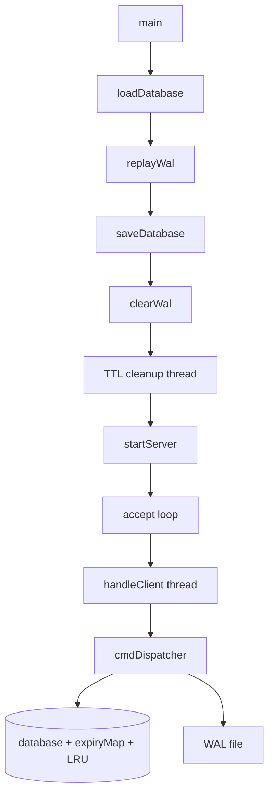

# db_server

A from-scratch, **Redis-inspired** in-memory key-value server written in **C++17**. This is a learning project — it is **not** the official Redis codebase. It implements a TCP server with string keys/values, persistence, TTL, LRU eviction, and multi-client concurrency.

**Repository:** [github.com/gaurav-singh2525/redis](https://github.com/gaurav-singh2525/redis)

---

## Table of contents

- [Features](#features)
- [Architecture](#architecture)
- [Project structure](#project-structure)
- [Requirements](#requirements)
- [Build and run](#build-and-run)
- [Protocol](#protocol)
- [Commands](#commands)
- [Examples](#examples)
- [Persistence](#persistence)
- [LRU cache eviction](#lru-cache-eviction)
- [TTL (time-to-live)](#ttl-time-to-live)
- [Concurrency](#concurrency)
- [Logging](#logging)
- [Limitations](#limitations)

---

## Features

| Area | What it does |
|------|----------------|
| **Networking** | TCP server on port **9000**, `SO_REUSEADDR`, listen backlog of 5 |
| **Concurrency** | One detached thread per client; shared `dbMutex`; atomic client IDs |
| **Protocols** | Plain text (newline-delimited) and partial **RESP** input for incoming commands |
| **Commands** | `PING`, `SET`, `GET`, `DEL`, `COUNT`, `EXPIRE`, `TTL`, `CLEAR`, `LRU`, `CAPACITY` |
| **LRU eviction** | Least-recently-used eviction when key count exceeds `MAX_CAPACITY` (default **10**) |
| **TTL** | Per-key expiry with `EXPIRE` / `TTL`; lazy + background cleanup |
| **Persistence** | Snapshot file (`data/store.cdb`) + write-ahead log (`data/wal.log`) |
| **Recovery** | On startup: load snapshot → replay WAL → checkpoint → clear WAL |
| **CLEAR** | Full reset: memory, LRU, WAL, and snapshot |
| **Logging** | Timestamped logs to stdout for connections and mutating operations |

---

## Architecture

### Startup sequence

On launch, `main` runs recovery before accepting clients:

1. **Load** snapshot from `data/store.cdb`
2. **Replay** WAL from `data/wal.log`
3. **Checkpoint** — save merged state back to `data/store.cdb`
4. **Clear** WAL (empty log after clean checkpoint)
5. **Start** background TTL cleanup thread (1-second interval)
6. **Listen** on TCP port 9000



### Runtime model

- The **main thread** runs the accept loop (`src/server.cpp`).
- Each connection gets a **detached worker thread** (`src/client_handler.cpp`) that reads input, dispatches commands, and sends replies.
- A **background TTL thread** (`src/ttl_cleanup.cpp`) periodically removes expired keys.
- All shared state (`database`, `expiryMap`, LRU structures) is protected by **`dbMutex`**.

### Module overview

| File | Role |
|------|------|
| `src/main.cpp` | Startup: persistence recovery, TTL thread, server |
| `src/server.cpp` | Socket create, bind, listen, accept |
| `src/client_handler.cpp` | Per-client I/O; text and RESP framing |
| `src/db.cpp` | Command dispatcher |
| `src/parser.cpp` | Plain-text command parsing |
| `src/resp.cpp` | RESP array parsing |
| `src/lru.cpp` | LRU list: touch, insert, remove, evict |
| `src/persistence.cpp` | Load/save snapshot, WAL replay |
| `src/wal.cpp` | Append/truncate WAL |
| `src/ttl_cleanup.cpp` | Background expiry sweeper |
| `src/logger.cpp` | Timestamped logging |
| `src/global.cpp` | Global DB, mutex, LRU, `MAX_CAPACITY` |
| `include/` | Headers |

---

## Project structure

```
redis/
├── include/          # Headers (db, server, lru, persistence, wal, resp, …)
├── src/              # Implementation (.cpp)
├── data/             # Runtime data (gitignored)
│   ├── store.cdb     # Snapshot (key=value lines)
│   └── wal.log       # Write-ahead log
├── Makefile
└── README.md
```

Persistence files under `data/` are listed in `.gitignore` and are created at runtime.

---

## Requirements

- **g++** with **C++17** support
- **Linux** (or POSIX environment with Berkeley sockets)
- **pthread** (linked via `-pthread` in the Makefile)

---

## Build and run

```bash
mkdir -p data    # first time only
make             # builds ./db_server
./db_server      # start server

# or
make run         # build + run
make clean       # remove binary
```

Connect with any TCP client:

```bash
nc localhost 9000
```

Send one command per line. The server appends `\n` to each response.

---

## Protocol

### Plain text (default)

Commands are a single line, space-separated. Values for `SET` may contain spaces (everything after the second token is the value).

```
SET mykey hello world
GET mykey
PING
```

### RESP (input only)

Incoming requests may use the Redis **array of bulk strings** format. The client handler assembles full RESP messages before dispatching.

Example equivalent to `SET foo bar`:

```
*3
$3
SET
$3
foo
$3
bar
```

(Use `\r\n` line endings when sending from tools that expect RESP.)

**Note:** Responses are **plain text + newline**, not RESP-encoded. This server is not fully compatible with `redis-cli` unless you account for that.

---

## Commands

All command names are **case-insensitive**. Wrong arity returns `INVALID COMMAND`.

| Command | Syntax | Success / typical response | WAL | LRU / TTL |
|---------|--------|----------------------------|-----|-----------|
| `PING` | `PING` | `PONG` | No | — |
| `SET` | `SET key value` | `OK` | Yes (`SET key value`) | Inserts/updates LRU; clears TTL on key; may evict |
| `GET` | `GET key` | value or `NULL` | No | Touches LRU (MRU); lazy expiry |
| `DEL` | `DEL key` | `OK` or `DNE` | Yes (`DEL key`) | Removes key from LRU and TTL |
| `EXPIRE` | `EXPIRE key seconds` | `OK` or `KEY DNE` | Yes (absolute unix timestamp) | No LRU change |
| `TTL` | `TTL key` | seconds remaining, `NO TTL`, or `TTL EXPIRED OR KEY DNE` | No | Lazy expiry check |
| `COUNT` | `COUNT` | Integer (key count) | No | Sweeps expired keys first |
| `LRU` | `LRU` | Keys MRU → LRU, one per line, or `EMPTY` | No | Read-only |
| `CAPACITY` | `CAPACITY` | Max key count (e.g. `10`) | No | Read-only |
| `CLEAR` | `CLEAR` | `OK` | Clears WAL file | Clears DB, TTL, LRU, snapshot |

### Command details

#### `PING`

Health check. No arguments.

```
PING
→ PONG
```

#### `SET`

Store a string value. Overwriting a key clears its TTL. If the database is at capacity, the **least recently used** key is evicted (and a `DEL` is written to the WAL).

```
SET user:1 Alice
→ OK
```

#### `GET`

Return the value, or `NULL` if missing or expired. A successful read marks the key as **most recently used**.

```
GET user:1
→ Alice
```

#### `DEL`

Delete a key. Returns `DNE` if the key does not exist.

```
DEL user:1
→ OK
```

#### `EXPIRE`

Set a TTL in **seconds** from now. Key must exist.

```
EXPIRE session:abc 300
→ OK
```

The WAL stores an **absolute** Unix timestamp for correct replay after restarts.

#### `TTL`

Return remaining seconds, or:

- `NO TTL` — key exists but has no expiry
- `TTL EXPIRED OR KEY DNE` — missing or already expired

```
TTL session:abc
→ 287
```

#### `COUNT`

Return the number of keys in the database. Expired keys (by TTL) are removed before counting.

```
COUNT
→ 5
```

#### `LRU`

Print the current LRU order from **most recently used** (top) to **least recently used** (bottom), one key per line. Returns `EMPTY` if there are no keys in the LRU list.

```
LRU
→ key_a
  key_b
  key_c
```

#### `CAPACITY`

Return the configured maximum number of keys (`MAX_CAPACITY` in `src/global.cpp`, currently **10**).

```
CAPACITY
→ 10
```

#### `CLEAR`

Full database reset:

- Clears in-memory `database`, `expiryMap`, and LRU structures
- Truncates `data/wal.log` and `data/store.cdb`

```
CLEAR
→ OK
```

---

## Examples

### LRU eviction

With `MAX_CAPACITY = 10`, adding an 11th distinct key evicts the LRU key:

```
CAPACITY
→ 10

SET k1 v1
SET k2 v2
…
SET k10 v10
SET k11 v11    # evicts least recently used key

LRU            # k11 is MRU; evicted key no longer listed
```

`GET` on a key moves it to the MRU position.

### TTL

```
SET temp data
EXPIRE temp 5
TTL temp
→ 4

# after 5+ seconds, or after background sweep:
GET temp
→ NULL
```

### Persistence across restart

```
SET persistent hello
# stop server (Ctrl+C), then restart ./db_server
GET persistent
→ hello
```

After a clean shutdown, startup reloads from `store.cdb` and any WAL not yet checkpointed.

---

## Persistence

### Snapshot — `data/store.cdb`

- Format: one entry per line, `key=value`
- Saved on startup after WAL replay (checkpoint)
- Load skips malformed lines (no `=`, multiple `=`, empty key/value)
- **TTL is not stored** in the snapshot — only key/value pairs

### Write-ahead log — `data/wal.log`

Append-only log for durability between checkpoints:

| Operation | WAL entry |
|-----------|-----------|
| `SET` | `SET key value` |
| `DEL` | `DEL key` |
| `EXPIRE` | `EXPIRE key <unix_timestamp>` |
| LRU eviction | `DEL <evicted_key>` |
| `CLEAR` | WAL file truncated (no entry kept) |

### Recovery flow

```
load store.cdb  →  replay wal.log  →  save store.cdb  →  clear wal.log
```

If the process crashes mid-run, uncheckpointed WAL entries are replayed on the next start.

**Caveat:** WAL writes are not `fsync`'d; a crash may lose the last buffered writes.

---

## LRU cache eviction

- **Structure:** `std::list` (order) + `std::unordered_map` of iterators (O(1) lookup)
- **Capacity:** `MAX_CAPACITY` in `src/global.cpp` (currently **10**)
- **Order:** Front = MRU, back = LRU
- **Updates:** `SET` inserts/touches; `GET` touches; `DEL` / expiry / eviction removes
- **Eviction:** When `database.size() > MAX_CAPACITY`, the LRU key is removed and `DEL` is appended to the WAL

To change capacity, edit `MAX_CAPACITY` in `src/global.cpp` and rebuild.

---

## TTL (time-to-live)

- **`EXPIRE key seconds`** — relative TTL at runtime; stored as absolute time in `expiryMap` and WAL
- **`TTL key`** — seconds remaining
- **`SET` on a key** — clears any existing TTL for that key
- **Expiry paths:**
  - **Lazy:** `GET`, `TTL`, `isExpired()` during command handling
  - **Active:** background thread every 1 second (`cleanupExpiredKeys`)
  - **`COUNT`:** sweeps expired keys before returning size

Expired keys are removed from `database`, `expiryMap`, and the LRU list.

---

## Concurrency

- **Model:** Thread-per-client (detached threads on each `accept`)
- **Synchronization:** Single `dbMutex` guards `database`, `expiryMap`, and LRU structures
- **Logging:** Separate mutex for stdout to avoid garbled log lines
- **Tradeoff:** Simple and correct for learning; high connection counts create many threads and mutex contention

---

## Logging

Logs go to **stdout** with timestamps:

```
[2026-05-21 12:00:00] Server listening on port 9000...
[2026-05-21 12:00:05] New Client Connected
[2026-05-21 12:00:10] Client:1 set key: foo as bar
```

Logged events include server start, client connect/disconnect, `SET`, `DEL`, and `EXPIRE`.

---

## Limitations

This is an educational server, not production Redis:

- **Responses are not RESP** — only incoming RESP is parsed
- **Not compatible with stock `redis-cli`** without expecting plain-text replies
- **No `fsync`** — durability is best-effort
- **TTL not in snapshot** — after checkpoint + WAL clear, TTL state depends on WAL replay until next checkpoint
- **Port 9000 is hardcoded**
- **String-only** key-value store (no lists, hashes, pub/sub, etc.)
- **Keys/values containing `=`** may break snapshot load
- **Invalid numeric input** to `EXPIRE` / `TTL` / RESP parsing can throw (`stoi` / `stoll`)
- **No connection limit** — unbounded threads under heavy load
- **Receive buffer** is 1024 bytes per read; very large lines may need multiple reads (pending buffer handles fragmentation)

---

## License

No license file is included in this repository. Add one if you intend to distribute the project.
